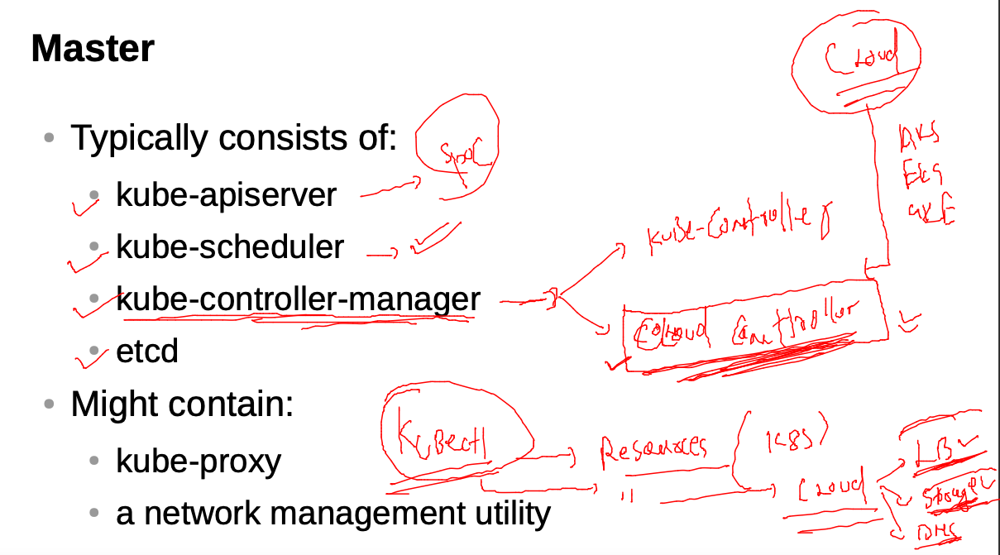
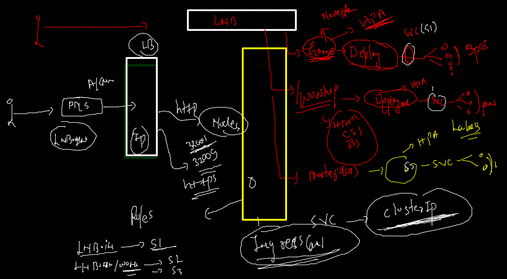
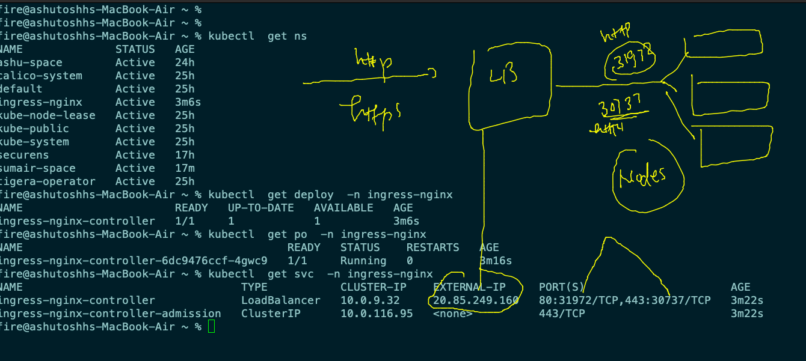
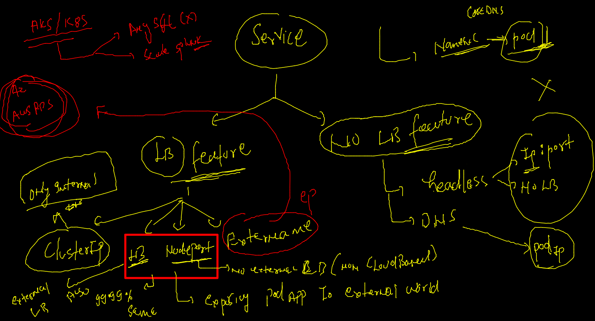

# AKS

## REvision --

## CLoud controller manager / kube controller manager 



### micro service based ingress and deployment with HPA understaning 



### before deploy ingress controlle i am cleaning up  my deployment 

```
kubectl delete all --all
pod "init-container-example-1" deleted
pod "pod1" deleted
pod "web" deleted
service "httpd" deleted
service "my-headless-service" deleted
service "nginx" deleted
service "web" deleted
fire@ashutoshhs-MacBook-Air ~ % kubectl  get ns
NAME                   STATUS   AGE
ashu-space             Active   24h
calico-system          Active   25h
default                Active   25h
kube-node-lease        Active   25h
kube-public            Active   25h
kube-system            Active   25h
kubernetes-dashboard   Active   22h
securens               Active   17h
sumair-space           Active   11m
tigera-operator        Active   25h
fire@ashutoshhs-MacBook-Air ~ % kubectl  delete ns  kubernetes-dashboard  
namespace "kubernetes-dashboard" deleted

```

### Deploy nginx ingress controller in AKS  from azure shell 

```
 helm repo add ingress-nginx https://kubernetes.github.io/ingress-nginx
 helm repo update 
 helm install ingress-nginx ingress-nginx/ingress-nginx --create-namespace --namespace ingress-nginx
 
```

### Ingress watch 



## Service in k8s



