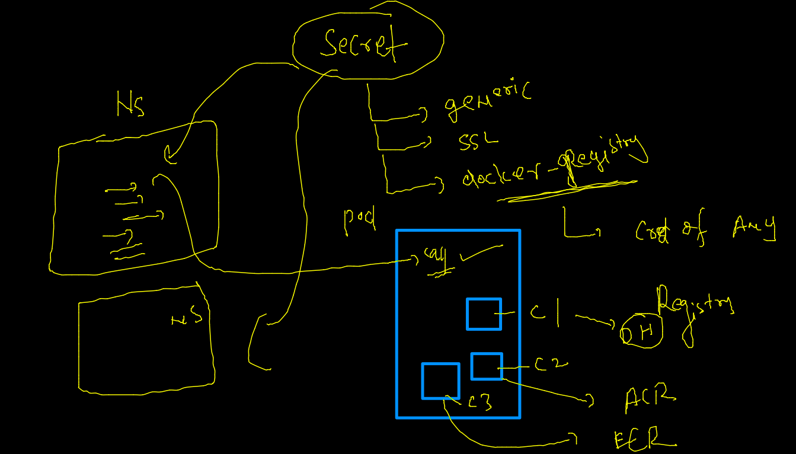
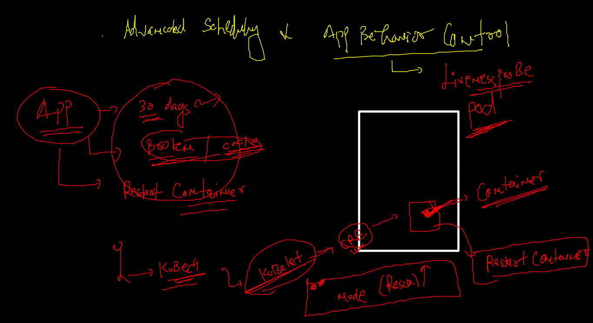
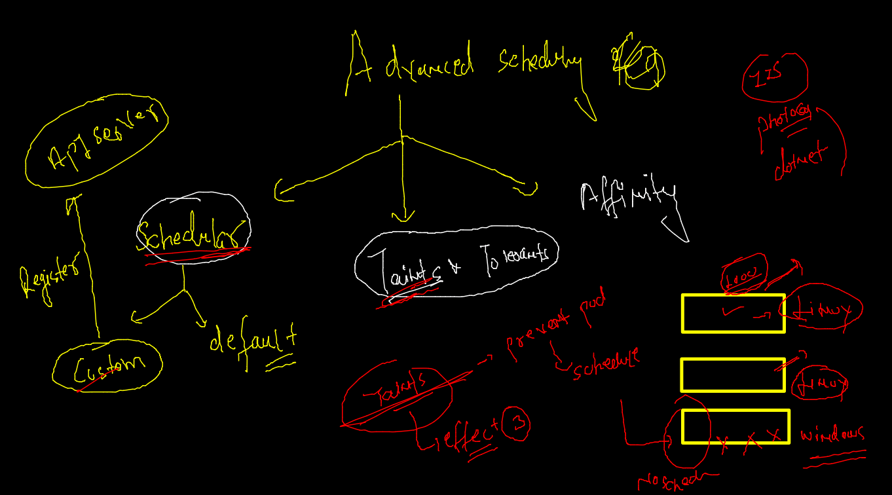
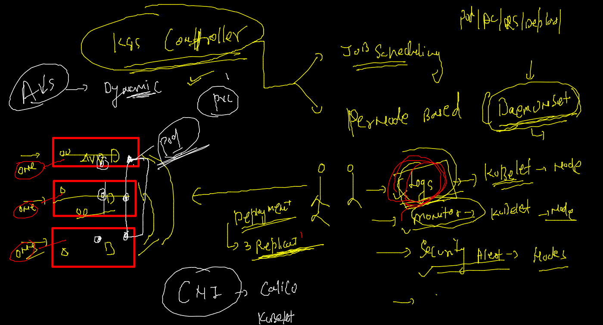
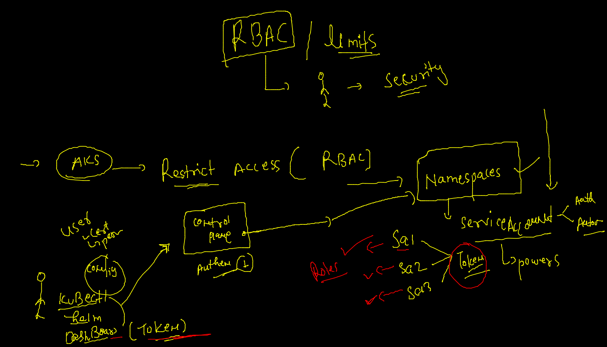
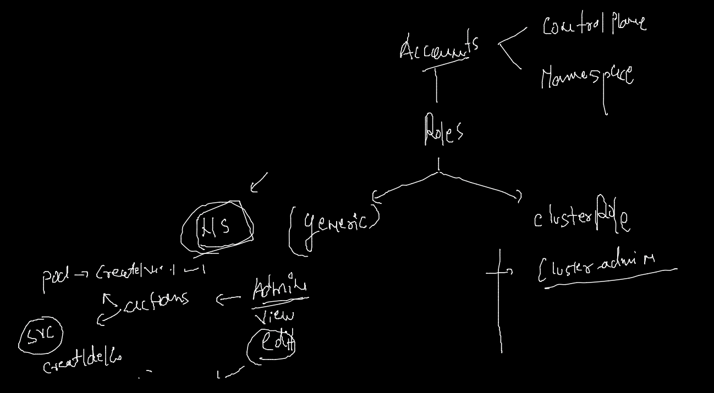

# AKS

## REvision --

## CLoud controller manager / kube controller manager 


### micro service based ingress and deployment with HPA understaning 


### before deploy ingress controlle i am cleaning up  my deployment 

```
kubectl delete all --all
pod "init-container-example-1" deleted
pod "pod1" deleted
pod "web" deleted
service "httpd" deleted
service "my-headless-service" deleted
service "nginx" deleted
service "web" deleted
fire@ashutoshhs-MacBook-Air ~ % kubectl  get ns
NAME                   STATUS   AGE
ashu-space             Active   24h
calico-system          Active   25h
default                Active   25h
kube-node-lease        Active   25h
kube-public            Active   25h
kube-system            Active   25h
kubernetes-dashboard   Active   22h
securens               Active   17h
sumair-space           Active   11m
tigera-operator        Active   25h
fire@ashutoshhs-MacBook-Air ~ % kubectl  delete ns  kubernetes-dashboard  
namespace "kubernetes-dashboard" deleted

```

### Deploy nginx ingress controller in AKS  from azure shell 

```
 helm repo add ingress-nginx https://kubernetes.github.io/ingress-nginx
 helm repo update 
 helm install ingress-nginx ingress-nginx/ingress-nginx --create-namespace --namespace ingress-nginx
 
```

### Ingress watch 


## Service in k8s


### pushing image in ACR 

```
docker  tag  dockerashu/nodeapp:v1   ashutoshh.azurecr.io/pwcnode:appv1 
[sumair@ip-172-31-84-215 ~]$ 
[sumair@ip-172-31-84-215 ~]$ docker login   ashutoshh.azurecr.io
Username: ashutoshh
Password: 
WARNING! Your password will be stored unencrypted in /home/sumair/.docker/config.json.
Configure a credential helper to remove this warning. See
https://docs.docker.com/engine/reference/commandline/login/#credentials-store

Login Succeeded
[sumair@ip-172-31-84-215 ~]$ docker  push  ashutoshh.azurecr.io/pwcnode:appv1 
The push refers to repository [ashutoshh.azurecr.io/pwcnode]
a437cf5b3db0: Pushing [==================================================>]  201.3MB
11fc80ef4d26: Pushed 
93743162602b: Pushed 
f943c8afb872: Pushed 
ccaeecdb
```

### deploying private image from ACR --

```
fire@ashutoshhs-MacBook-Air yamls % kubectl apply -f  ashunodeapp.yaml 
deployment.apps/nodepapp created
fire@ashutoshhs-MacBook-Air yamls % 
fire@ashutoshhs-MacBook-Air yamls % kubectl  get  deploy 
NAME       READY   UP-TO-DATE   AVAILABLE   AGE
nodepapp   0/1     1            0           12s
fire@ashutoshhs-MacBook-Air yamls % kubectl  get  po     
NAME                       READY   STATUS             RESTARTS   AGE
nodepapp-d976b48b7-lkp2p   0/1     ImagePullBackOff   0          21s
fire@ashutoshhs-MacBook-Air yamls % kubectl  get  po -w
NAME                       READY   STATUS             RESTARTS   AGE
nodepapp-d976b48b7-lkp2p   0/1     ImagePullBackOff   0          29s
nodepapp-d976b48b7-lkp2p   0/1     ErrImagePull       0          32s

```

### creating secret for registry cred 

```
 kubectl  create  secret 
Create a secret using specified subcommand.

Available Commands:
  docker-registry Create a secret for use with a Docker registry
  generic         Create a secret from a local file, directory, or literal value
  tls             Create a TLS secret

Usage:
  kubectl create secret [flags] [options]

Use "kubectl <command> --help" for more information about a given command.
Use "kubectl options" for a list of global command-line options (applies to all commands).
fire@ashutoshhs-MacBook-Air ~ % kubectl  create  secret  docker-registry   acrsec  --docker-server=ashutoshh.azurecr.io       --docker-username=ashutoshh  --docker-password="bWlEAidI0qBuJ9zlIK=Twczq4wPzoMT+"  --dry-run=client -o yaml 
apiVersion: v1
data:
  .dockerconfigjson: eyJhdXRocyI6eyJhc2h1dG9zaGguYXp1cmVjci5pbyI6eyJ1c2VybmFtZSI6ImFzaHV0b3NoaCIsInBhc3N3b3JkIjoiYldsRUFpZEkwcUJ1Sjl6bElLPVR3Y3pxNHdQem9NVCsiLCJhdXRoIjoiWVhOb2RYUnZjMmhvT21KWGJFVkJhV1JKTUhGQ2RVbzVlbXhKU3oxVWQyTjZjVFIzVUhwdlRWUXIifX19
kind: Secret
metadata:
  creationTimestamp: null
  name: acrsec
type: kubernetes.io/dockerconfigjson
fire@ashutoshhs-MacBook-Air ~ % kubectl  create  secret  docker-registry   acrsec  --docker-server=ashutoshh.azurecr.io       --docker-username=ashutoshh  --docker-password="bWlEAidI0qBuJ9zlIK=Twczq4wPzoMT+"

```

### secret info 



### app behaviour controll 



### checking. app from service 

```
 kubectl  exec -it checkpod -- sh 
/ # apk add curl 
fetch https://dl-cdn.alpinelinux.org/alpine/v3.15/main/x86_64/APKINDEX.tar.gz
fetch https://dl-cdn.alpinelinux.org/alpine/v3.15/community/x86_64/APKINDEX.tar.gz
(1/5) Installing ca-certificates (20211220-r0)
(2/5) Installing brotli-libs (1.0.9-r5)
(3/5) Installing nghttp2-libs (1.46.0-r0)
(4/5) Installing libcurl (7.80.0-r0)
(5/5) Installing curl (7.80.0-r0)
Executing busybox-1.34.1-r3.trigger
Executing ca-certificates-20211220-r0.trigger
OK: 8 MiB in 19 packages
/ # curl  http://checksvc
<!DOCTYPE html>


```
### app behavour control 

[COntroll](https://kubernetes.io/docs/tasks/configure-pod-container/configure-liveness-readiness-startup-probes/)

## Taints -- applied in Nodes 



### tainting to Node 

```
kubectl  taint  node  aks-agentpool-25714751-vmss000000   x=hellopwc:NoSchedule 
node/aks-agentpool-25714751-vmss000000 tainted

```

###  k8s advanced controller -- Daemonsets



## RBAC in k8s



### roles and cluster 



### roles commands 

```
kubectl  api-resources  |   grep -i roles
clusterroles                                   rbac.authorization.k8s.io/v1           false        ClusterRole
roles                                          rbac.authorization.k8s.io/v1           true         Role
fire@ashutoshhs-MacBook-Air ~ % 
fire@ashutoshhs-MacBook-Air ~ % 
fire@ashutoshhs-MacBook-Air ~ % kubectl  get  roles
No resources found in ashu-space namespace.
fire@ashutoshhs-MacBook-Air ~ % kubectl  get  roles -n kube-system
NAME                                             CREATED AT
extension-apiserver-authentication-reader        2022-02-09T03:18:46Z
system::leader-locking-kube-controller-manager   2022-02-09T03:18:46Z
system::leader-locking-kube-scheduler            2022-02-09T03:18:46Z
system:controller:bootstrap-signer               2022-02-09T03:18:46Z
system:controller:cloud-provider                 2022-02-09T03:18:46Z
system:controller:token-cleaner                  2022-02-09T03:18:46Z
tunnelfront-secret                               2022-02-09T03:19:20Z
fire@ashutoshhs-MacBook-Air ~ % 
fire@ashutoshhs-MacBook-Air ~ % 
fire@ashutoshhs-MacBook-Air ~ % kubectl  get  clusterroles  
NAME                                                                   CREATED AT
admin                                                                  2022-02-09T03:18:43Z
aks-service                                                            2022-02-09T03:19:15Z
calico-kube-controllers                                                2022-02-09T03:21:04Z
calico-node                                                            2022-02-09T03:21:04Z
calico-typha                                                      

```


