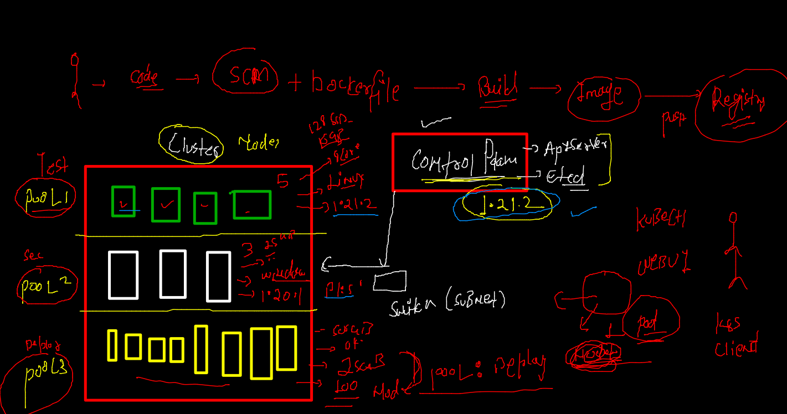
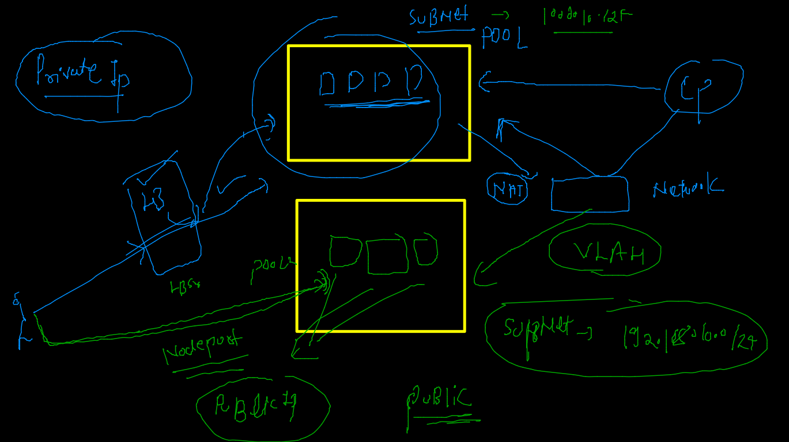
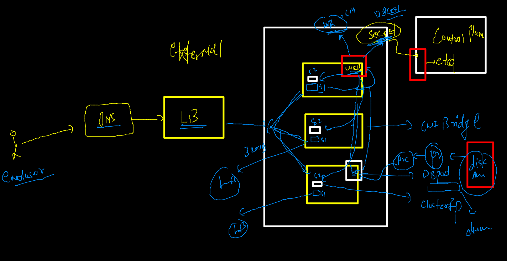
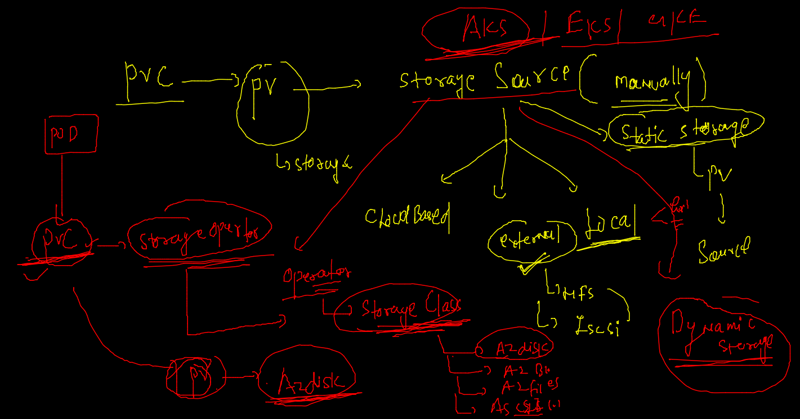

# AKS

## AKS cluster --



### nodepool concept 



### Real world app with front end and backend Db deployment 


### app 



### dyanmic storage by storage operator -- using storgae class 



### storage class in aks 

```
kubectl  get  sc
NAME                    PROVISIONER          RECLAIMPOLICY   VOLUMEBINDINGMODE      ALLOWVOLUMEEXPANSION   AGE
azurefile               file.csi.azure.com   Delete          Immediate              true                   2d2h
azurefile-csi           file.csi.azure.com   Delete          Immediate              true                   2d2h
azurefile-csi-premium   file.csi.azure.com   Delete          Immediate              true                   2d2h
azurefile-premium       file.csi.azure.com   Delete          Immediate              true                   2d2h
default (default)       disk.csi.azure.com   Delete          WaitForFirstConsumer   true                   2d2h
managed                 disk.csi.azure.com   Delete          WaitForFirstConsumer   true                   2d2h
managed-csi             disk.csi.azure.com   Delete          WaitForFirstConsumer   true                   2d2h
managed-csi-premium     disk.csi.azure.com   Delete          WaitForFirstConsumer   true                   2d2h
managed-premium         disk.csi.azure.com   Delete          WaitForFirstConsumer   true                   2d2h

```


### deploy DB with SC 

```
 kubectl apply -f  . 
secret/dbsec configured
deployment.apps/ashuapp-db created
persistentvolumeclaim/azure-managed-disk1 unchanged
namespace/ashuwebapp configured

```

===

```
kubectl  get  deploy 
NAME         READY   UP-TO-DATE   AVAILABLE   AGE
ashuapp-db   0/1     1            0           17s
fire@ashutoshhs-MacBook-Air ~ % kubectl  get  po     
NAME                         READY   STATUS              RESTARTS   AGE
ashuapp-db-f6dcc586c-tcmc4   0/1     ContainerCreating   0          28s
fire@ashutoshhs-MacBook-Air ~ % kubectl  get  po -w
NAME                         READY   STATUS              RESTARTS   AGE
ashuapp-db-f6dcc586c-tcmc4   0/1     ContainerCreating   0          34s
ashuapp-db-f6dcc586c-tcmc4   0/1     ContainerCreating   0          37s
ashuapp-db-f6dcc586c-tcmc4   1/1     Running             0          45s
^C%                                                                                                                          fire@ashutoshhs-MacBook-Air ~ % kubectl  get  po   
NAME                         READY   STATUS    RESTARTS   AGE
ashuapp-db-f6dcc586c-tcmc4   1/1     Running   0          48s
fire@ashutoshhs-MacBook-Air ~ % kubectl  get  pvc
NAME                  STATUS   VOLUME                                     CAPACITY   ACCESS MODES   STORAGECLASS      AGE
azure-managed-disk1   Bound    pvc-8d8f8904-192d-4ba5-87ea-12cd70e3bf94   5Gi        RWO            managed-premium   18m
fire@ashutoshhs-MacBook-Air ~ % 
fire@ashutoshhs-MacBook-Air ~ % kubectl get  pv
NAME                                       CAPACITY   ACCESS MODES   RECLAIM POLICY   STATUS   CLAIM                            STORAGECLASS      REASON   AGE
pvc-8d8f8904-192d-4ba5-87ea-12cd70e3bf94   5Gi        RWO            Delete           Bound    ashuwebapp/azure-managed-disk1   managed-premium            59s


```

