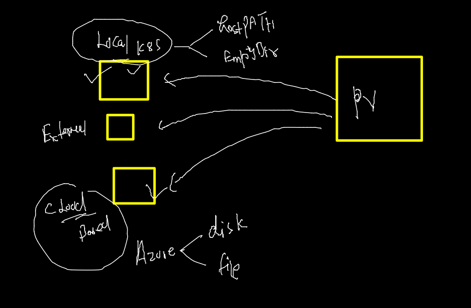

# AKS

### creating and setting namespaces 

```

fire@ashutoshhs-MacBook-Air ~ % kubectl  create  namespace  ashu-space  --dry-run=client -o yaml 
apiVersion: v1
kind: Namespace
metadata:
  creationTimestamp: null
  name: ashu-space
spec: {}
status: {}
fire@ashutoshhs-MacBook-Air ~ % kubectl  create  namespace  ashu-space                           
namespace/ashu-space created
fire@ashutoshhs-MacBook-Air ~ % kubectl get  ns
NAME              STATUS   AGE
ashu-space        Active   3s
calico-system     Active   60m
default           Active   62m
kube-node-lease   Active   63m
kube-public       Active   63m
kube-system       Active   63m
tigera-operator   Active   62m
fire@ashutoshhs-MacBook-Air ~ % kubectl config set-context  --current --namespace=ashu-space
Context "nonprod" modified.
fire@ashutoshhs-MacBook-Air ~ % 
fire@ashutoshhs-MacBook-Air ~ % kubectl get  po 
No resources found in ashu-space namespace.

```
## k8s controller 


### journey from Pod -RC - RS - deployment 


### scaling story of POD 


### create deployment --

```
kubectl  create  deployment ashudep  --image=dockerashu/ashuwebapp:pwcfeb82022  --port 80 --dry-run=client -o yaml

```

### deploy the deployment 

```
kubectl  apply -f  deployment.yaml 
deployment.apps/ashudep created
fire@ashutoshhs-MacBook-Air yamls % kubectl get  deployment 
NAME      READY   UP-TO-DATE   AVAILABLE   AGE
ashudep   1/1     1            1           10s
fire@ashutoshhs-MacBook-Air yamls % kubectl get  deploy     
NAME      READY   UP-TO-DATE   AVAILABLE   AGE
ashudep   1/1     1            1           13s
 kubectl get  po    
NAME                       READY   STATUS    RESTARTS   AGE
ashudep-77b65b6d94-4szl9   1/1     Running   0          54s
fire@ashutoshhs-MacBook-Air yamls % kubectl get  po -o wide
NAME                       READY   STATUS    RESTARTS   AGE   IP            NODE                                NOMINATED NODE   READINESS GATES
ashudep-77b65b6d94-4szl9   1/1     Running   0          62s   10.244.2.11   aks-agentpool-25714751-vmss000001   <none>           <none>
fire@ashutoshhs-MacBook-Air yamls % 


```

### manual scaling --

```
 kubectl  get deployment 
NAME      READY   UP-TO-DATE   AVAILABLE   AGE
ashudep   1/1     1            1           6m39s
fire@ashutoshhs-MacBook-Air ~ % 
fire@ashutoshhs-MacBook-Air ~ % 
fire@ashutoshhs-MacBook-Air ~ % kubectl  scale  deployment  ashudep  --replicas=3
deployment.apps/ashudep scaled
fire@ashutoshhs-MacBook-Air ~ % 
fire@ashutoshhs-MacBook-Air ~ % kubectl  get deployment                          
NAME      READY   UP-TO-DATE   AVAILABLE   AGE
ashudep   1/3     3            1           7m4s
fire@ashutoshhs-MacBook-Air ~ % kubectl  get deployment 
NAME      READY   UP-TO-DATE   AVAILABLE   AGE
ashudep   3/3     3            3           7m9s
fire@ashutoshhs-MacBook-Air ~ % kubectl  get po         
NAME                       READY   STATUS    RESTARTS   AGE
ashudep-77b65b6d94-hdb84   1/1     Running   0          15s
ashudep-77b65b6d94-jnggb   1/1     Running   0          102s
ashudep-77b65b6d94-rsnmw   1/1     Running   0          15s
fire@ashutoshhs-MacBook-Air ~ % kubectl  get po -o wide
NAME                       READY   STATUS    RESTARTS   AGE    IP            NODE                                NOMINATED NODE   READINESS GATES
ashudep-77b65b6d94-hdb84   1/1     Running   0          25s    10.244.0.5    aks-agentpool-25714751-vmss000000   <none>           <none>
ashudep-77b65b6d94-jnggb   1/1     Running   0          112s   10.244.2.13   aks-agentpool-25714751-vmss000001   <none>           <none>
ashudep-77b65b6d94-rsnmw   1/1     Running   0          25s    10.244.1.7    aks-agentpool-25714751-vmss000002   <none>           <none>

```

### HPA needs


### HPA rule 

```
 kubectl  get deploy 
NAME      READY   UP-TO-DATE   AVAILABLE   AGE
ashudep   1/1     1            1           29m
fire@ashutoshhs-MacBook-Air yamls % kubectl  autoscale deploy  ashudep  --min=3  --max=20  --cpu-percent=75 
horizontalpodautoscaler.autoscaling/ashudep autoscaled
fire@ashutoshhs-MacBook-Air yamls % kubectl  get  hpa
NAME      REFERENCE            TARGETS         MINPODS   MAXPODS   REPLICAS   AGE
ashudep   Deployment/ashudep   <unknown>/75%   3         20        0          4s

```

### checking pod 

```
 kubectl  get deploy 
NAME      READY   UP-TO-DATE   AVAILABLE   AGE
ashudep   1/1     1            1           30m
fire@ashutoshhs-MacBook-Air ~ % kubectl  get  po    
NAME                       READY   STATUS    RESTARTS   AGE
ashudep-7f4bd96858-djz96   1/1     Running   0          30m
pod111                     1/1     Running   0          15m
fire@ashutoshhs-MacBook-Air ~ % kubectl delete pod pod111 
pod "pod111" deleted
fire@ashutoshhs-MacBook-Air ~ % kubectl  get deploy       
NAME      READY   UP-TO-DATE   AVAILABLE   AGE
ashudep   3/3     3            3           32m
fire@ashutoshhs-MacBook-Air ~ % kubectl  get  po    
NAME                       READY   STATUS    RESTARTS   AGE
ashudep-7f4bd96858-djz96   1/1     Running   0          32m
ashudep-7f4bd96858-rtcvs   1/1     Running   0          73s
ashudep-7f4bd96858-s64rg   1/1     Running   0          73s
```

### Dashboard deployment in k8s using deployment resource 

```
 kubectl apply -f https://raw.githubusercontent.com/kubernetes/dashboard/v2.4.0/aio/deploy/recommended.yaml
namespace/kubernetes-dashboard created
serviceaccount/kubernetes-dashboard created
service/kubernetes-dashboard created
secret/kubernetes-dashboard-certs created
secret/kubernetes-dashboard-csrf created
secret/kubernetes-dashboard-key-holder created
configmap/kubernetes-dashboard-settings created
role.rbac.authorization.k8s.io/kubernetes-dashboard created
clusterrole.rbac.authorization.k8s.io/kubernetes-dashboard unchanged
rolebinding.rbac.authorization.k8s.io/kubernetes-dashboard created
clusterrolebinding.rbac.authorization.k8s.io/kubernetes-dashboard unchanged
deployment.apps/kubernetes-dashboard created
service/dashboard-metrics-scraper created
deployment.apps/dashboard-metrics-scraper created

```

### Editing service type to LB from ClusterIP 

```
 kubectl get  deploy  -n kubernetes-dashboard 
NAME                        READY   UP-TO-DATE   AVAILABLE   AGE
dashboard-metrics-scraper   1/1     1            1           110s
kubernetes-dashboard        1/1     1            1           111s
fire@ashutoshhs-MacBook-Air ~ % kubectl get  svc  -n kubernetes-dashboard 
NAME                        TYPE        CLUSTER-IP    EXTERNAL-IP   PORT(S)    AGE
dashboard-metrics-scraper   ClusterIP   10.0.225.12   <none>        8000/TCP   2m31s
kubernetes-dashboard        ClusterIP   10.0.51.60    <none>        443/TCP    2m37s
fire@ashutoshhs-MacBook-Air ~ % kubectl edit   svc  kubernetes-dashboard     -n kubernetes-dashboard  
service/kubernetes-dashboard edited
fire@ashutoshhs-MacBook-Air ~ % kubectl get  svc  -n kubernetes-dashboard                            
NAME                        TYPE           CLUSTER-IP    EXTERNAL-IP   PORT(S)         AGE
dashboard-metrics-scraper   ClusterIP      10.0.225.12   <none>        8000/TCP        5m18s
kubernetes-dashboard        LoadBalancer   10.0.51.60    <pending>     443:31579/TCP   5m24s
fire@ashutoshhs-MacBook-Air ~ % 

```

### secret 


### gettting token secret for dashboard --


### everynamespace has SA which need ROle to access resources 


### giving role access to sa 

```
kubectl create clusterrolebinding  mybind  --clusterrole=cluster-admin  --serviceaccount=kubernetes-dashboard:kubernetes-dashboard
```

### How svc to Pod 


### pod always need label to get selected by service 

```
 kubectl  get  po 
NAME                       READY   STATUS    RESTARTS   AGE
ashudep-7f4bd96858-rtcvs   1/1     Running   0          64m
ashudep-7f4bd96858-s64rg   1/1     Running   0          64m
ashudep-7f4bd96858-xx64v   1/1     Running   0          62m
ashupod-123444             1/1     Running   0          5m5s
ashupod1                   1/1     Running   0          19m
fire@ashutoshhs-MacBook-Air ~ % kubectl  get  po  --show-labels
NAME                       READY   STATUS    RESTARTS   AGE     LABELS
ashudep-7f4bd96858-rtcvs   1/1     Running   0          64m     app=ashudep,pod-template-hash=7f4bd96858
ashudep-7f4bd96858-s64rg   1/1     Running   0          64m     app=ashudep,pod-template-hash=7f4bd96858
ashudep-7f4bd96858-xx64v   1/1     Running   0          62m     app=ashudep,pod-template-hash=7f4bd96858
ashupod-123444             1/1     Running   0          5m10s   <none>
```
### PV and PVC 


### checking aks resource list

```
 kubectl api-resources            
NAME                              SHORTNAMES   APIVERSION                             NAMESPACED   KIND
bindings                                       v1                                     true         Binding
componentstatuses                 cs           v1                                     false        ComponentStatus
configmaps                        cm           v1                                     true         ConfigMap
endpoints                         ep           v1                                     true         Endpoints
events                            ev           v1                                     true         Event
limitranges                       limits       v1                                     true         LimitRange
namespaces                        ns           v1                                     false        Namespace
nodes                             no           v1       
```

### PV creation 



### Deploy PV -- this will be done by storge 

```
 kubectl apply -f  ashupv.yaml 
persistentvolume/ashupv-1 created
fire@ashutoshhs-MacBook-Air yamls % kubectl  get  pv
NAME       CAPACITY   ACCESS MODES   RECLAIM POLICY   STATUS      CLAIM   STORAGECLASS   REASON   AGE
ashupv-1   5Gi        RWO            Retain           Available           manual                  7s
fire@ashutoshhs-MacBook-Air yamls % 

```

### PVC creation 

```
kubectl apply -f  ashupv.yaml
persistentvolume/ashupv-1 unchanged
persistentvolumeclaim/ashu-pvc-db created
```

### creating MYSQL deployment with single pod replica 

```
 kubectl  create deployment  ashudb --image=mysql  --port 3306 --dry-run=client -o yaml 
```

### secret in k8s


### creating secret to store mysql db user password

```
kubectl  create secret  generic  ashudbsec    --from-literal  key123=PwcDb098  --dry-run=client -o yaml 
apiVersion: v1
data:
  key123: UHdjRGIwOTg=
kind: Secret
metadata:
  creationTimestamp: null
  name: ashudbsec


```

### Deploydb 

```
 kubectl apply -f  ashupv.yaml                                    persistentvolume/ashupv-1 unchanged
persistentvolumeclaim/ashu-pvc-db unchanged
deployment.apps/ashudb created
secret/ashudbsec created
fire@ashutoshhs-MacBook-Air yamls % kubectl  get  pv
NAME       CAPACITY   ACCESS MODES   RECLAIM POLICY   STATUS   CLAIM                    STORAGECLASS   REASON   AGE
ashupv-1   5Gi        RWO            Retain           Bound    ashu-space/ashu-pvc-db   manual                  38m
fire@ashutoshhs-MacBook-Air yamls % kubectl  get  pvc
NAME          STATUS   VOLUME     CAPACITY   ACCESS MODES   STORAGECLASS   AGE
ashu-pvc-db   Bound    ashupv-1   5Gi        RWO            manual         31m
fire@ashutoshhs-MacBook-Air yamls % kubectl  get  deploy
NAME     READY   UP-TO-DATE   AVAILABLE   AGE
ashudb   1/1     1            1           22s
fire@ashutoshhs-MacBook-Air yamls % kubectl  get  secret
NAME                  TYPE                                  DATA   AGE
ashudbsec             Opaque                                1      29s
default-token-5624d   kubernetes.io/service-account-token   3      5h20m
fire@ashutoshhs-MacBook-Air yamls % kubectl  get  po    
NAME                      READY   STATUS    RESTARTS   AGE
ashudb-5dbd54fc54-c8p82   1/1     Running   0          42s

```
### access db container /pod 

```
 kubectl exec  -it   ashudb-5dbd54fc54-c8p82 -- bash 
root@ashudb-5dbd54fc54-c8p82:/# cat  /etc/os-release 
PRETTY_NAME="Debian GNU/Linux 10 (buster)"
NAME="Debian GNU/Linux"
VERSION_ID="10"
VERSION="10 (buster)"
VERSION_CODENAME=buster
ID=debian
HOME_URL="https://www.debian.org/"
SUPPORT_URL="https://www.debian.org/support"
BUG_REPORT_URL="https://bugs.debian.org/"
root@ashudb-5dbd54fc54-c8p82:/# mysql  -u root  -p 
Enter password: 
Welcome to the MySQL monitor.  Commands end with ; or \g.
Your MySQL connection id is 8
Server version: 8.0.28 MySQL Community Server - GPL

Copyright (c) 2000, 2022, Oracle and/or its affiliates.

Oracle is a registered trademark of Oracle Corporation and/or its
affiliates. Other names may be trademarks of their respective
owners.

Type 'help;' or '\h' for help. Type '\c' to clear the current input statement.

mysql> show databases;
+--------------------+
| Database           |
+--------------------+
| information_schema |
| mysql              |
| performance_schema |
| sys                |
+--------------------+
4 rows in set (0.00 sec)

mysql> create  database pwc;
Query OK, 1 row affected (0.00 sec)

mysql> exit;
Bye
root@ashudb-5dbd54fc54-c8p82:/# exit
exit

```

### Db with webapp understanding 


### pod design pattern in k8s


### access multi container 
```
 kubectl  get  po 
NAME                      READY   STATUS    RESTARTS   AGE
ashudb-5dbd54fc54-c8p82   1/1     Running   0          63m
datagen                   2/2     Running   0          6s
fire@ashutoshhs-MacBook-Air yamls % kubectl  exec -it  datagen -- bash       
Defaulted container "sidecar" out of: sidecar, datagen
root@datagen:/# cd  /usr/share/nginx/html/
root@datagen:/usr/share/nginx/html# ls
a.txt
root@datagen:/usr/share/nginx/html# rm  a.txt 
rm: cannot remove 'a.txt': Read-only file system
root@datagen:/usr/share/nginx/html# exit 
exit
command terminated with exit code 1
fire@ashutoshhs-MacBook-Air yamls % kubectl  exec -it  datagen -c  datagen -- sh   
/ # 
/ # 
/ # cd  /mnt/data/
/mnt/data # ls
a.txt
/mnt/data # cat a.txt 
i am data generator
i am data generator
i am data generator
i am data generator
i am data generator
/mnt/data # exit
fire@ashutoshhs-MacBook-Air yamls % 
```


