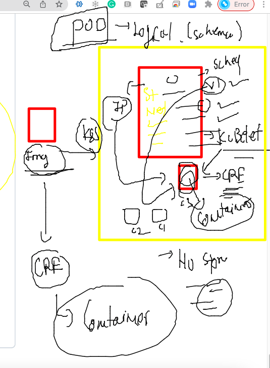

# AKS

## day1 Revision --


### connecting to aks using azure shell 


### kubectl cred reading from client machine 


### kubectl some commands 

```
 kubectl  get  nodes
NAME                                STATUS   ROLES   AGE    VERSION
aks-agentpool-40604622-vmss000000   Ready    agent   159m   v1.21.7
aks-agentpool-40604622-vmss000001   Ready    agent   159m   v1.21.7
aks-agentpool-40604622-vmss000002   Ready    agent   159m   v1.21.7
ashutoshh@Azure:~$
ashutoshh@Azure:~$ kubectl  get  no
NAME                                STATUS   ROLES   AGE    VERSION
aks-agentpool-40604622-vmss000000   Ready    agent   160m   v1.21.7
aks-agentpool-40604622-vmss000001   Ready    agent   160m   v1.21.7
aks-agentpool-40604622-vmss000002   Ready    agent   160m   v1.21.7
ashutoshh@Azure:~$ kubectl  get  no -o wide
NAME                                STATUS   ROLES   AGE    VERSION   INTERNAL-IP   EXTERNAL-IP   OS-IMAGE             KERNEL-VERSION     CONTAINER-RUNTIME
aks-agentpool-40604622-vmss000000   Ready    agent   160m   v1.21.7   10.240.0.4    <none>        Ubuntu 18.04.6 LTS   5.4.0-1067-azure   containerd://1.4.9+a
zure
aks-agentpool-40604622-vmss000001   Ready    agent   160m   v1.21.7   10.240.0.5    <none>        Ubuntu 18.04.6 LTS   5.4.0-1067-azure   containerd://1.4.9+a
zure
aks-agentpool-40604622-vmss000002   Ready    agent   160m   v1.21.7   10.240.0.6    <none>        Ubuntu 18.04.6 LTS   5.4.0-1067-azure   containerd://1.4.9+azure

```
### pushing image to docker hub first 


### pushin image 

```
docker  tag  ashuwebapp:v1   docker.io/dockerashu/ashuwebapp:pwcfeb82022

 docker  login 
Login with your Docker ID to push and pull images from Docker Hub. If you don't have a Docker ID, head over to https://hub.docker.com to create one.
Username: dockerashu
Password: 
WARNING! Your password will be stored unencrypted in /home/user1/.docker/config.json.
Configure a credential helper to remove this warning. See
https://docs.docker.com/engine/reference/commandline/login/#credentials-store

Login Succeeded
[user1@ip-172-31-84-215 ~]$ docker  push docker.io/dockerashu/ashuwebapp:pwcfeb82022
The push refers to repository [docker.io/dockerashu/ashuwebapp]
fe24c9473bac: Pushed 
762b147902c0: Pushed 
235e04e3592a: Pushed 
6173b6fa63db: Pushed 
9a94c4a55fe4: Pushed 
9a3a6af98e18: Pushed 
7d0ebbe3f5d2: Pushed 
pwcfeb82022: digest: sha256:a89ffb268e2ce632c29508ec8ffcbb4dd27ea982ec03c63e8facd53f7e53fc83 size: 1780
[user1@ip-172-31-84-215 ~]$ docker logout
Removing login credentials for https://index.docker.io/v1/

```

### smallest unit in k8s is POD 



### Deploy my first POD 

```
ashutoshh@Azure:~$ whoami
ashutoshh
ashutoshh@Azure:~$ pwd
/home/ashutoshh
ashutoshh@Azure:~$ mkdir  ashu_yamls
ashutoshh@Azure:~$ cd ashu_yamls/
ashutoshh@Azure:~/ashu_yamls$
ashutoshh@Azure:~/ashu_yamls$ vim  ashupod1.yaml
ashutoshh@Azure:~/ashu_yamls$ vim  ashupod1.yaml
ashutoshh@Azure:~/ashu_yamls$ cat ashupod1.yaml
apiVersion: v1
kind: Pod
metadata:
 name: ashupod-123  # name of pod
spec: # appinfo like container / storage / schedular
 containers:
 - image: docker.io/dockerashu/ashuwebapp:pwcfeb82022
   name: ashuc1 # you can use same container name
   ports: # optional part these days
   - containerPort: 80
ashutoshh@Azure:~/ashu_yamls$ kubectl  apply -f ashupod1.yaml
pod/ashupod-123 created
ashutoshh@Azure:~/ashu_yamls$ kubectl  get pods
NAME          READY   STATUS              RESTARTS   AGE
ashupod-123   0/1     ContainerCreating   0          15s
ashutoshh@Azure:~/ashu_yamls$ kubectl  get pods
NAME          READY   STATUS    RESTARTS   AGE
ashupod-123   1/1     Running   0          34s

```

### More pod details 

```
kubectl  get  po
NAME          READY   STATUS    RESTARTS   AGE
ashupod-123   1/1     Running   0          49m
ashutoshh@Azure:~$ kubectl  get  po  -o wide
NAME          READY   STATUS    RESTARTS   AGE   IP           NODE                                NOMINATED NODE   READINESS GATES
ashupod-123   1/1     Running   0          49m   10.244.0.5   aks-agentpool-40604622-vmss000002   <none>           <none>
ashutoshh@Azure:~$

```

### Describe pod info 

```
 kubectl  describe pod ashupod-123
Name:         ashupod-123
Namespace:    default
Priority:     0
Node:         aks-agentpool-40604622-vmss000002/10.240.0.6
Start Time:   Tue, 08 Feb 2022 05:33:36 +0000
Labels:       <none>
Annotations:  cni.projectcalico.org/containerID: 7015e621ca487dd0c6746c6d72cd6fe818b65ab1cf3cdc3e1cdbf6f52b071c8e
              cni.projectcalico.org/podIP: 10.244.0.5/32
              cni.projectcalico.org/podIPs: 10.244.0.5/32
Status:       Running
IP:           10.244.0.5
IPs:
  IP:  10.244.0.5
Containers:
  ashuc1:
    Container ID:   containerd://e55c25eb128494d22fcc25d87c1193f9aa20b2dc5cd9cd105663a1f266306a2f
    Image:          docker.io/dockerashu/ashuwebapp:pwcfeb82022
    Image ID:       docker.io/dockerashu/ashuwebapp@sha256:a89ffb268e2ce632c29508ec8ffcbb4dd27ea982ec03c63e8facd53f7e53fc83
    Port:           80/TCP
```

### accessing container inside POD 

```
 kubectl exec -it  ashupod-123 --  bash
root@ashupod-123:/#
root@ashupod-123:/#
root@ashupod-123:/# uname -r
5.4.0-1067-azure
root@ashupod-123:/# cat /etc/os-release
PRETTY_NAME="Debian GNU/Linux 11 (bullseye)"
NAME="Debian GNU/Linux"
VERSION_ID="11"
VERSION="11 (bullseye)"
VERSION_CODENAME=bullseye
ID=debian
HOME_URL="https://www.debian.org/"
SUPPORT_URL="https://www.debian.org/support"
BUG_REPORT_URL="https://bugs.debian.org/"
root@ashupod-123:/# ls
bin   dev                  docker-entrypoint.sh  home  lib64  mnt  proc  run   srv  tmp  var
boot  docker-entrypoint.d  etc                   lib   media  opt  root  sbin  sys  usr
root@ashupod-123:/# exit
exit

```

### az login --

```
 az login 
The default web browser has been opened at https://login.microsoftonline.com/organizations/oauth2/v2.0/authorize. Please continue the login in the web browser. If no web browser is available or if the web browser fails to open, use device code flow with `az login --use-device-code`.
[
  {
    "cloudName": "AzureCloud",
    "homeTenantId": "199ee0d2-f16c-4bcc-8282-a04937c02e5d",
    "id": "a91b42ca-7e1b-41d2-89d1-be09970ee26c",
    "isDefault": true,
    "managedByTenants": [],
    "name": "Azure Pass - Sponsorship",
    "state": "Enabled",
    "tenantId": "199ee0d2-f16c-4bcc-8282-a04937c02e5d",
    "user": {
      "name": "learntechbyme@gmail.com",
      "type": "user"
    }
  }
]

```
### az login from local and setup cred 

```
fire@ashutoshhs-MacBook-Air ~ % az account set --subscription a91b42ca-7e1b-41d2-89d1-be09970ee26c
fire@ashutoshhs-MacBook-Air ~ % az aks get-credentials --resource-group aks_training --name 123
/Users/fire/.kube/config has permissions "644".
It should be readable and writable only by its owner.
Merged "123" as current context in /Users/fire/.kube/config
fire@ashutoshhs-MacBook-Air ~ % 
fire@ashutoshhs-MacBook-Air ~ % kubectl  get  nodes
NAME                                STATUS   ROLES   AGE     VERSION
aks-agentpool-40604622-vmss000000   Ready    agent   4h41m   v1.21.7
aks-agentpool-40604622-vmss000001   Ready    agent   4h41m   v1.21.7
aks-agentpool-40604622-vmss000002   Ready    agent   4h41m   v1.21.7
fire@ashutoshhs-MacBook-Air ~ % kubectl get  po
NAME          READY   STATUS    RESTARTS   AGE
ashupod-123   1/1     Running   0          62m

```

### COnnecting AKS from local system -- using azure cli 

[Download](https://docs.microsoft.com/en-us/cli/azure/install-azure-cli)


### Deleting pods 
```
 kubectl get  pods
NAME             READY   STATUS    RESTARTS   AGE
ashupod-123      1/1     Running   0          76m
ashupod-123444   1/1     Running   0          6m31s
fire@ashutoshhs-MacBook-Air yamls % kubectl get  pods -o wide
NAME             READY   STATUS    RESTARTS   AGE     IP           NODE                                NOMINATED NODE   READINESS GATES
ashupod-123      1/1     Running   0          76m     10.244.0.5   aks-agentpool-40604622-vmss000002   <none>           <none>
ashupod-123444   1/1     Running   0          6m36s   10.244.0.7   aks-agentpool-40604622-vmss000002   <none>           <none>
fire@ashutoshhs-MacBook-Air yamls % kubectl  delete  pod  --all
pod "ashupod-123" deleted
pod "ashupod-123444" deleted


```
### namespaces ---


###

```
amls % 
fire@ashutoshhs-MacBook-Air yamls % kubectl  get  namespaces
NAME              STATUS   AGE
calico-system     Active   5h4m
default           Active   5h6m
kube-node-lease   Active   5h6m
kube-public       Active   5h6m
kube-system       Active   5h6m
tigera-operator   Active   5h5m
fire@ashutoshhs-MacBook-Air yamls % 
fire@ashutoshhs-MacBook-Air yamls % kubectl  get  pods
No resources found in default namespace.
fire@ashutoshhs-MacBook-Air yamls % 
fire@ashutoshhs-MacBook-Air yamls % kubectl  get  ns  
NAME              STATUS   AGE
calico-system     Active   5h5m
default           Active   5h7m
kube-node-lease   Active   5h7m
kube-public       Active   5h7m
kube-system       Active   5h7m
tigera-operator   Active   5h7m
```

### kube-system --

```
 kubectl  get  po -n kube-system 
NAME                                  READY   STATUS    RESTARTS   AGE
coredns-845757d86-jkjv9               1/1     Running   0          5h8m
coredns-845757d86-jxrh7               1/1     Running   0          5h6m
coredns-autoscaler-5f85dc856b-qgkjx   1/1     Running   0          5h8m
csi-azuredisk-node-7bxfq              3/3     Running   0          5h7m
csi-azuredisk-node-956kb              3/3     Running   0          5h6m
csi-azuredisk-node-dfhqk              3/3     Running   0          5h6m
csi-azurefile-node-fx7wf              3/3     Running   0          5h6
```

### creating custom namespaces --

```
1009  kubectl  create   namespace  ashu-webappsonly 
 1010  kubectl  get   ns
 1011  kubectl  create   namespace  ashu-databases
 1012  kubectl  get   ns
fire@ashutoshhs-MacBook-Air yamls % kubectl get  ns
NAME               STATUS   AGE
ashu-databases     Active   23s
ashu-webappsonly   Active   46s
calico-system      Active   5h10m
default            Active   5h11m

```

### namespace based pod deployment 

```
 kubectl  apply -f  pod1.yaml 
pod/ashupod-123444 created
fire@ashutoshhs-MacBook-Air yamls % kubectl get  po
No resources found in default namespace.
fire@ashutoshhs-MacBook-Air yamls % kubectl get  po -n  ashu-webappsonly 
NAME             READY   STATUS    RESTARTS   AGE
ashupod-123444   1/1     Running   0          17s
```

### AUtogenerate yaml / json 

```
kubectl  run  ashupod1  --image=alpine  --command ping localhost --dry-run=client -o yaml     >autopod.yaml
```
### deploy / delete 

```
% kubectl apply -f autopod.yaml 
pod/ashupod1 created
fire@ashutoshhs-MacBook-Air yamls % kubectl  get  po
NAME       READY   STATUS    RESTARTS   AGE
ashupod1   1/1     Running   0          3s
fire@ashutoshhs-MacBook-Air yamls % kubectl delete  -f autopod.yaml
pod "ashupod1" deleted


```

