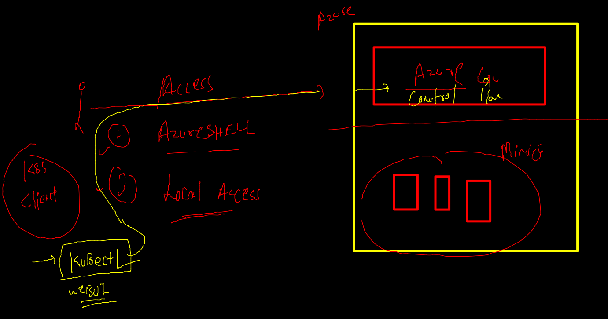

# AKS

## app deployment / testing problem in Past : 


### bare-metal problem solved by Hypervisor 


### VM proble 


### OS components 


### vm vs cre 


### app containerization process -- BUild -- RUN -- 


### image building process 


### image build done 

```
docker build -t ashuwebapp:v1 . 

```

### creating container --

```
docker  run  -d  --name  ashuc1  -p  1234:80  ashuwebapp:v1  
90b6d9c8914c56b10bc12bb349536ed0c9ab2717fb82359974f2c439442bf363
[test@ip-172-31-84-215 data]$ 
[test@ip-172-31-84-215 data]$ 
[test@ip-172-31-84-215 data]$ docker  ps
CONTAINER ID   IMAGE           COMMAND                  CREATED          STATUS          PORTS                                   NAMES
90b6d9c8914c   ashuwebapp:v1   "/docker-entrypoint.…"   3 seconds ago    Up 2 seconds    0.0.0.0:1234->80/tcp, :::1234->80/tcp   ashuc1
d9c295f968d6   ponwebapp:v1    "/docker-entrypoint.…"   34 minutes ago   Up 34 minutes   0.0.0.0:80->80/tcp, :::80->80/tcp       elated_chandrasekhar

```

### getting started with AKS 



### Container runtime Engine problems --


### k8s 


### intro 


### hardware arch 


### k8s Minion Side --


### Kube-apiserver 


### k8s client side software 


### checking --

```
kubectl  version --client 
Client Version: version.Info{Major:"1", Minor:"22

```

### kube-schedular --


### etcd 


### manage vs unmanaged k8s cluster


### azure k8s access


### any app deployment process in aks 


### from container image to running container journey 


