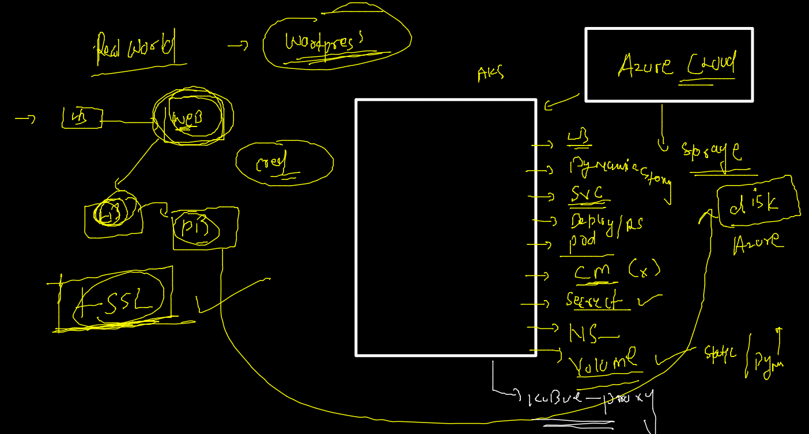

# AKS

## AKS cluster --


### nodepool concept 


### Real world app with front end and backend Db deployment 



### app 


### dyanmic storage by storage operator -- using storgae class 


### storage class in aks 

```
kubectl  get  sc
NAME                    PROVISIONER          RECLAIMPOLICY   VOLUMEBINDINGMODE      ALLOWVOLUMEEXPANSION   AGE
azurefile               file.csi.azure.com   Delete          Immediate              true                   2d2h
azurefile-csi           file.csi.azure.com   Delete          Immediate              true                   2d2h
azurefile-csi-premium   file.csi.azure.com   Delete          Immediate              true                   2d2h
azurefile-premium       file.csi.azure.com   Delete          Immediate              true                   2d2h
default (default)       disk.csi.azure.com   Delete          WaitForFirstConsumer   true                   2d2h
managed                 disk.csi.azure.com   Delete          WaitForFirstConsumer   true                   2d2h
managed-csi             disk.csi.azure.com   Delete          WaitForFirstConsumer   true                   2d2h
managed-csi-premium     disk.csi.azure.com   Delete          WaitForFirstConsumer   true                   2d2h
managed-premium         disk.csi.azure.com   Delete          WaitForFirstConsumer   true                   2d2h

```


### deploy DB with SC 

```
 kubectl apply -f  . 
secret/dbsec configured
deployment.apps/ashuapp-db created
persistentvolumeclaim/azure-managed-disk1 unchanged
namespace/ashuwebapp configured

```

===

```
kubectl  get  deploy 
NAME         READY   UP-TO-DATE   AVAILABLE   AGE
ashuapp-db   0/1     1            0           17s
fire@ashutoshhs-MacBook-Air ~ % kubectl  get  po     
NAME                         READY   STATUS              RESTARTS   AGE
ashuapp-db-f6dcc586c-tcmc4   0/1     ContainerCreating   0          28s
fire@ashutoshhs-MacBook-Air ~ % kubectl  get  po -w
NAME                         READY   STATUS              RESTARTS   AGE
ashuapp-db-f6dcc586c-tcmc4   0/1     ContainerCreating   0          34s
ashuapp-db-f6dcc586c-tcmc4   0/1     ContainerCreating   0          37s
ashuapp-db-f6dcc586c-tcmc4   1/1     Running             0          45s
^C%                                                                                                                          fire@ashutoshhs-MacBook-Air ~ % kubectl  get  po   
NAME                         READY   STATUS    RESTARTS   AGE
ashuapp-db-f6dcc586c-tcmc4   1/1     Running   0          48s
fire@ashutoshhs-MacBook-Air ~ % kubectl  get  pvc
NAME                  STATUS   VOLUME                                     CAPACITY   ACCESS MODES   STORAGECLASS      AGE
azure-managed-disk1   Bound    pvc-8d8f8904-192d-4ba5-87ea-12cd70e3bf94   5Gi        RWO            managed-premium   18m
fire@ashutoshhs-MacBook-Air ~ % 
fire@ashutoshhs-MacBook-Air ~ % kubectl get  pv
NAME                                       CAPACITY   ACCESS MODES   RECLAIM POLICY   STATUS   CLAIM                            STORAGECLASS      REASON   AGE
pvc-8d8f8904-192d-4ba5-87ea-12cd70e3bf94   5Gi        RWO            Delete           Bound    ashuwebapp/azure-managed-disk1   managed-premium            59s


```

### namespace -- backup 

```
83  kubectl  get  all   -o yaml  >namespaceback.yaml 
 1084  kubectl delete  all --all
 1085  kubectl  get  all
 1086  kubectl  get  all
 1087  kubectl  get  all
 1088  kubectl apply -f  namespaceback.yaml
 
```

### SSL based deployment model 


### app vs network based ssl 


### creating self sign certificate 

```
 openssl  req -x509 -newkey rsa:4096  -keyout  privatekey.pem -out cert.pem -days 365       -nodes 
Generating a 4096 bit RSA private key
....................................................++
.........................................++
writing new private key to 'privatekey.pem'
-----
You are about to be asked to enter information that will be incorporated
into your certificate request.
What you are about to enter is what is called a Distinguished Name or a DN.
There are quite a few fields but you can leave some blank
For some fields there will be a default value,
If you enter '.', the field will be left blank.
-----
Country Name (2 letter code) []:IN
State or Province Name (full name) []:RAJ
Locality Name (eg, city) []:JAIPUR
Organization Name (eg, company) []:PWC
Organizational Unit Name (eg, section) []:TECH
Common Name (eg, fully qualified host name) []:securepwc.ashutoshh.in
Email Address []:
fire@ashutoshhs-MacBook-Air Desktop % mkdir  certs
fire@ashutoshhs-MacBook-Air Desktop % mv privatekey.pem certs 
fire@ashutoshhs-MacBook-Air Desktop % mv cert.pem certs 
fire@ashutoshhs-MacBook-Air Desktop % cd  certs 
fire@ashutoshhs-MacBook-Air certs % ls
cert.pem	privatekey.pem

```

### RBAC understanding --


### namespace reality 

```
 kubectl  create   namespace   restricted-space  
namespace/restricted-space created
fire@ashutoshhs-MacBook-Air certs % kubectl  get ns
NAME                   STATUS   AGE
ashu-space             Active   2d5h
ashuwebapp             Active   4h13m
calico-system          Active   2d6h
default                Active   2d6h
ingress-nginx          Active   28h
kube-node-lease        Active   2d6h
kube-public            Active   2d6h
kube-system            Active   2d6h
kubernetes-dashboard   Active   27h
restricted-space       Active   35s
securens               Active   45h
sumair-space           Active   28h
tigera-operator        Active   2d6h
fire@ashutoshhs-MacBook-Air certs % kubectl  get  sa  -n  restricted-space
NAME      SECRETS   AGE
default   1         59s
fire@ashutoshhs-MacBook-Air certs % kubectl  get  secret  -n  restricted-space
NAME                  TYPE                                  DATA   AGE
default-token-vgvx2   kubernetes.io/service-account-token   3      88s
fire@ashutoshhs-MacBook-Air certs % kubectl  get  cm   -n  restricted-space
NAME               DATA   AGE
kube-root-ca.crt   1      100s

```


